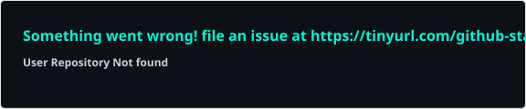

<div align="center">

<!-- Animated Wave Header -->


<!-- Animated Typing Header -->
<a href="https://git.io/typing-svg">
  
</a>

<br/>


</div>

<br/>

## 🧭 Table of Contents
<details open>
<summary>Click to expand</summary>

- [👨‍💻 About Me](#-about-me)
- [🛠️ Tech Stack](#️-tech-stack)
- [📊 GitHub Analytics](#-github-analytics)
- [🔥 Contribution Streak](#-contribution-streak)
- [🐍 Contribution Snake](#-contribution-snake)
- [📈 Activity Graph](#-activity-graph)
- [🏆 GitHub Trophies](#-github-trophies)
- [🚀 Featured Projects](#-featured-projects)
- [💼 Experience & Leadership](#-experience--leadership)
- [🎓 Achievements & Certifications](#-achievements--certifications)
- [🌐 Open Source Contributions](#-open-source-contributions)
- [📫 Connect With Me](#-connect-with-me)
- [💬 Developer Quote](#-developer-quote)

</details>

<br/>

## 👨‍💻 About Me


```java
public class SuryaGanesh {

    private String role      = "Full Stack Developer & Java Engineer";
    private String[] stack   = {"Java", "React", "Node.js", "TypeScript", "Supabase"};
    private String title     = "Microsoft Student Ambassador";
    private String status    = "Software Engineer Intern";
    private boolean openToWork = true;

    public String[] currentFocus() {
        return new String[] {
            "🔭 Building scalable full-stack applications",
            "🌱 Deepening expertise in System Design & Cloud Architecture",
            "🤝 Contributing to impactful Open Source projects",
            "⚡ Exploring AI-powered developer tooling",
            "🎯 Preparing for SDE roles at top product companies"
        };
    }
}
```

- 💡 I engineer **end-to-end web applications** — from pixel-perfect frontends to robust, scalable backends.
- ☕ Strong foundation in **Core Java, DSA, and OOP principles**, complemented by modern JS/TS ecosystems.
- 🎤 As a **Microsoft Student Ambassador**, I lead tech communities, host workshops, and mentor budding developers.
- 🧩 Passionate about **clean architecture, performance optimization, and developer experience**.
- 📚 Always learning — always shipping.

<br clear="right"/>

---

## 🛠️ Tech Stack

<div align="center">

### Languages


### Frontend


### Backend & Databases


### Cloud, DevOps & Tools


### Tools & Platforms


</div>

---

## 📊 GitHub Analytics

<div align="center">




</div>

<sub>⚙️ These cards are generated as static SVGs via GitHub Actions (see setup steps below) instead of the public Vercel API, which is frequently paused/rate-limited.</sub>

---

## 🔥 Contribution Streak

<div align="center">


</div>

---

## 🐍 Contribution Snake

<div align="center">


<sub>⚙️ Powered by <a href="https://github.com/Platane/snk">Platane/snk</a> — see setup instructions below to activate this on your profile.</sub>

</div>

---

## 📈 Activity Graph

<div align="center">


</div>

---

## 🏆 GitHub Trophies

<div align="center">


</div>

<sub>⚙️ Generated via GitHub Actions self-hosting (see setup steps below) instead of the shared public instance, which is frequently overloaded.</sub>

---

## 🚀 Featured Projects

<div align="center">

<a href="https://github.com/sgrscsurya/SkillMatrix">
  
</a>
<a href="https://github.com/bloodonar/Bloodonar">
  
</a>
<a href="https://github.com/sgrscsurya/WebScraperPro">
  
</a>
<a href="https://github.com/sgrscsurya/HoloForge-AI">
  
</a>

</div>

<table>
<tr>
<td width="50%">

### 🛒 [SkillMatrix](https://github.com/sgrscsurya/SkillMatrix)
Full-stack e-commerce platform with real-time inventory, secure payments, and role-based auth.

`React` `Node.js` `Supabase` `TypeScript`

</td>
<td width="50%">

### 📊 [Bloodonar](https://github.com/bloodonar/Bloodonar)
Analytics dashboard with live data visualization and RESTful Java Spring Boot backend.

`Java` `Spring Boot` `React` `PostgreSQL`

</td>
</tr>
<tr>
<td width="50%">

### 🤖 [WebScraperPro](https://github.com/sgrscsurya/WebScraperPro)
AI-powered productivity tool leveraging LLM APIs for smart task automation.

`Next.js` `TypeScript` `OpenAI API` `Tailwind`

</td>
<td width="50%">

### 🔐 [HoloForge-AI](https://github.com/sgrscsurya/HoloForge-AI)
Secure authentication microservice with JWT, OAuth2, and rate-limiting middleware.

`Java` `Spring Security` `Docker` `Redis`

</td>
</tr>
</table>

---

## 💼 Experience & Leadership

```
2025 — Present   💻 Software Engineer Intern @ Yuga Yatra Private Limited
                    → Building full-stack features across React/Node.js & Java services
                    → Collaborating in Agile sprints with cross-functional teams

2024 — Present   🌟 Microsoft Student Ambassador
                    → Hosted 10+ workshops on cloud, web dev & career readiness
                    → Grew campus tech community engagement by 40%+

2023 — Present   🎯 Open Source Contributor
                    → Active contributor across multiple public repositories
                    → Reviewing PRs, fixing issues, improving documentation
```

---

## 🎓 Achievements & Certifications

<div align="center">


</div>

- 🏅 **Microsoft Student Ambassador** — Recognized for community leadership & technical outreach
- 🥇 **Hackathon Winner** — PLACEHOLDER_HACKATHON_NAME (Top 3 among 200+ teams)
- 📜 **Certification** — PLACEHOLDER_CERTIFICATION_NAME (Issuing Body, Year)
- 🌟 **Open Source Recognition** — Merged PRs in PLACEHOLDER_PROJECT_NAME
- 🎯 **Competitive Programming** — 500+ problems solved across LeetCode & HackerRank

---

## 🌐 Open Source Contributions

<div align="center">

[](https://leetcode.com/u/surya_ganesh20/)
[](https://www.hackerrank.com/profile/sgrscsurya)

</div>

I actively contribute to open source projects, focusing on bug fixes, feature enhancements, and documentation improvements. I believe in giving back to the community that helped me grow as a developer.

**Areas of contribution:** Developer tools • Web frameworks • Java libraries • Documentation

---

## 📫 Connect With Me

<div align="center">

[](https://www.linkedin.com/in/sathi-surya-ganesh-reddy2004/)
[](https://portfolio-y5yc.onrender.com/)
[](mailto:sgrscsurya@gmail.com)
[](https://leetcode.com/u/surya_ganesh20/)
[](https://www.hackerrank.com/profile/sgrscsurya)

<br/>

### 🌐 Portfolio Preview

<a href="https://portfolio-y5yc.onrender.com/">

</a>

<sub>🔴 🟡 🟢 &nbsp; <code>portfolio-y5yc.onrender.com</code> &nbsp; — 🖱️ click the preview to open the live site.</sub>

</div>

---

## 💬 Developer Quote

<div align="center">

> *"Code is not just logic — it's the art of solving problems that matter."*


</div>

---

<div align="center">

### ⭐ If you find my work inspiring, consider giving my repositories a star!


</div>
